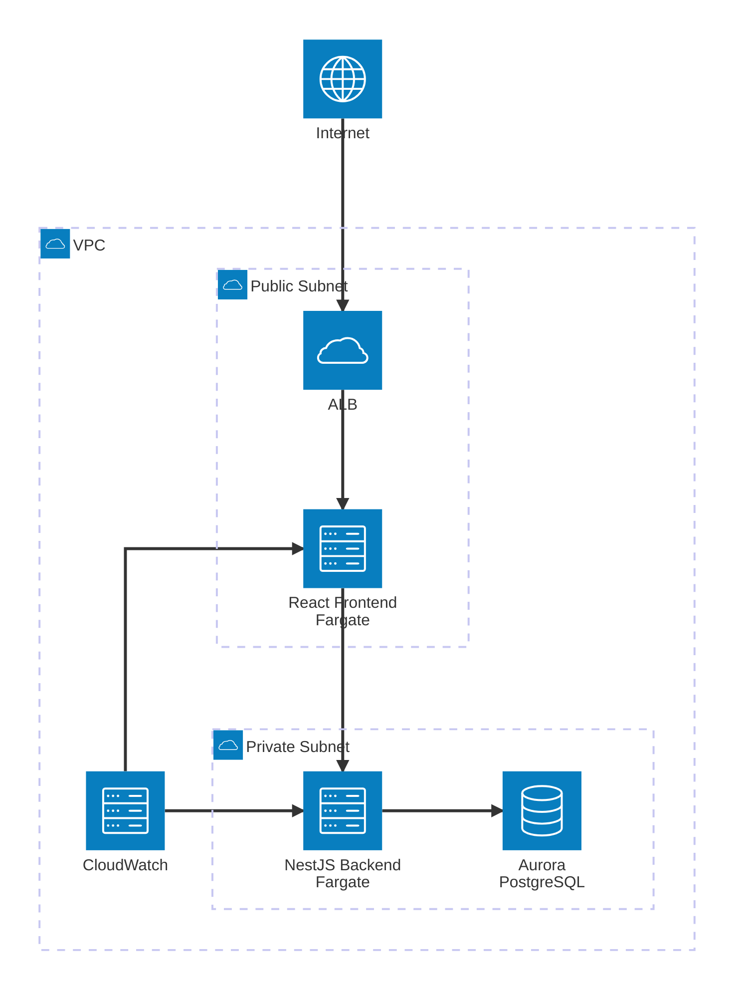

---
pdf_options:

  printBackground: true
  headerTemplate: |-
    
    <section></section>
  footerTemplate: |-
    <section style="display: flex; justify-content: space-between; align-items: center; width: 100%; padding: 5mm 10mm; font-family: system-ui; font-size: 11px;">
      

        
      

      

        /
      

    </section>
---

Architecture Document

Summary: This architecture document describes a basic application.

Table of Contents

# Functional Requirements

  - to be continue

# System Identification:

## Frontend
The application consists of a web frontend of "single page application" type:
  - strengthen desktop usage
  - simplify version upgrades
  - simplify SaaS implementation

## API Backend 
A business server part receives user commands from the Frontend and applies them to the database:
  - ensures security by managing authentication and authorization in production

## Database
  Stores the business data of the application

# Frameworks and Technologies

## Frontend
  React Framework Choice:
  - popularity and robustness

## Backend API: 
  KeystoneJS + Prisma + GraphQL:
  - GraphQL and SQL migration are generated. Only KeystoneJS model modification is necessary
  - need to use passportjs + gafam idp or an idp server (e.g keycloak)

  Supabase + Prisma:
  - use of Prisma to generate the SQL to be applied in Supabase's Postgres database.
  - simplified authentication and authorization management
  - use of supabase rest apis

## Database:
  PostgreSQL:
  - popularity, compatibility and robustness
  - possibility of multi-tenant RLS management (row level security)

# Deployment and Hosting Infrastructure

## AWS 
  - Authentication and authorization: optional if handled by API Backend or Supabase auth otherwise: AWS Cognito
  - Frontend: AWS S3 + CloudFront
  - API Backend: AWS Fargate service
  - Database: AWS Aurora PostgreSQL

[Source file](https://viewer.diagrams.net/?tags=%7B%7D&lightbox=1&highlight=0000ff&edit=_blank&layers=1&nav=1&dark=0#R%3Cmxfile%3E%3Cdiagram%20name%3D%22AWS%20Implementation%22%20id%3D%22aws-impl%22%3E7Zpbb%2BI4FMc%2FDdLuA1Uu0JRHLmVmpK7EDjPq7lNlEhOsmjhrmwL76fc4cSB2zBQ6dNRtaSs1PraPL%2Bf%2FO0kMrXC43HziKF%2F8wRJMW4GXbFrhqBUEfrcTwD9l2ZaWXicqDSkniW60N0zJv1gbPW1dkQQLo6FkjEqSm8aYZRmOpWFDnLO12WzOqDlqjlLcMExjRJvWe5LIhbb61719xWdM0oUe%2BibQ61uiqrFeiVighK1rpvC2FQ45Y7K8Wm6GmKrNq%2Fal7Dc%2BULubGMeZPKaDJBIW1eik%2FQi5rZYs8QbqBgu5pGDw4VJIzh7xkFHGwZKxDFoO5oRSy4QoSTMoxuAdg33whLkksJl9XbEkSaKGGawXROJpjmI15hqkAzbOVlmC1Ww95Z5lUsvBv67KepJqTuW0nxBd6Wn3eaycxnLFYZle%2F36qm8Ac8Ka2WL09nzBbYsm30GRRC2Cow7XeR7vjaZv2EtzostZ0pItIay3ded6HAy50RNzRQWvRjilbJcdEKGckk8Vg3QH8wfBDr9WFmqEqXQVdy2CXI9PgN0vKh2mwy5Fp8G33vjW%2Bb0%2BwZmiUDPeeNb5XmyD8hQO2kpRkoM8qBSj9pBwlBPbQkmhN1S4N1lUXWKpTXiHNSARjce2jiATmt0%2B4DEjZhlKUCzLb9eI4XnFBnvBXLErnygoJIVfXy02qcucVSKBzlQIFeTH9LzCWs%2FYBLh8KrTwgKht4toIQfsdKZi5GbSQly2vkUjwvPMKukCy9K0qjsOLRNUSCxGIHbRNKRaE33Av7VBp7TRy7PQtHz8TRD87AY8zSjEjWpNECtUaleMQyXuidcCLqxNSFqhPXJrJGswIixwi20WWLmka%2F2azirml02VxJxu7tO3r7Vu%2FDiB%2BSpI0%2B1I27najTq9WNCEApSYFYxrjSlkEL9BlGfuiPXXzNix9b%2FBVZd2iG6YQJot3PmJRs%2BSx6u5tmLUU9l46QyMvtmJONmoc7p3As2IrHuMwokI2EK7dUij9McR2JEzmObhoYVybtpGtC3D0DwyK84Ps%2B8L32%2BmEYnYZvEEV%2B8eT4MfAFsR8kdwogePd4BmuCR%2BNr2AJfDf%2FbV4xgeKif9H9%2FJaxfg%2Bs54imSjneZC9z%2FR7jH0c2t1zkN7pHXHfrRh4G7UvxBwscVEnu4%2B5MvUDFA8SPOktfCu%2FMKeOdMyBQ24h96Ifx9EN7pD4Je%2FzTC4d49guB9FMJ5Ig7TPSmJmP55Z9y9R9NfhfVZuGaQojIiIE2tuDjmmMtA%2Bqc06DiyrJqPDp1vvjl12WdN%2FiHFrUQxVkNM35X9JYK5bh7CVCbtxDoR9aPez%2BsFJylug2ja1XucMhhaccmnYO2g4GrqgrtiX31AoMJDkRAkNuPTPI52KQ3G59u%2FdKOi8LcqQFbVxdGmXjna1ksTzAlsS3GauD8%2Bk3Avx3pVtWOoH4eoApRjiiR5Mvepfnj2A5D1CBOls1ousI7XduXKRbnlulf9AwjbkZVUQnsu5cIbjgqd7JZ9vHRE2DZO8U6VTyW7s2vmEuYzh9l4IXzDYa7N8xLmE8Os966dzF4WZkMjvyDW5lvMJdzHh5uqZ6z2Qsr8qKfEt%2Fdx9fNCqT2Uff72bfKyT6qD5lNZx3wq8zuv8Bhfhsf5dv7uglO8cZ0nNKEZmm5ghebmbKFBYpvFHyA4%2Ff06z05OaKU7%2FwXhgeL%2B2z1lHtx%2FRyq8%2FQ8%3D%3C%2Fdiagram%3E%3C%2Fmxfile%3E)

# Annexe